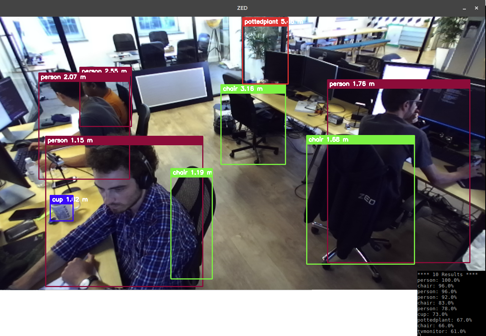

# Stereolabs ZED - YOLO in C++

This package lets you use YOLO the deep learning object detector using the ZED stereo camera and the ZED SDK C++.

The left image will be used to display the detected objects alongside the distance of each, using the ZED Depth.

## Prerequisites

- Ubuntu 16.04
- [ZED SDK](https://www.stereolabs.com/developers/) and its dependencies ([CUDA](https://developer.nvidia.com/cuda-downloads))
- OpenCV

## Compile Darknet

We will use a fork of darknet from @AlexeyAB : https://github.com/AlexeyAB/darknet

- It is already present in the folder libdarknet

- Simply call make in the folder

        cd libdarknet
        make -j4

- For more information regarding the compilation instructions, check the darknet Readme [here](../libdarknet/README.md)

## Build and Run the application

### Build the sample with cmake

Go to the sample folder

        cd zed_cpp_sample/

Create a build directory and generate a solution from the CMake

        mkdir build
        cd build
        cmake ..
        make

### Setup the application

- Download the model file, for instance Yolov3 tiny

        wget https://pjreddie.com/media/files/yolov3-tiny.weights

### Run the sample

To launch the ZED with YOLO simply run the sample, be careful to the path, the folder has to match to find the configuration files and weights file :

        ./darknet_zed ../../libdarknet/data/coco.names ../../libdarknet/cfg/yolov3-tiny.cfg yolov3-tiny.weights

The input parameters can be changed using the command line :

        ./darknet_zed <meta> <config> <weight> <meta> <svo_file> <threshold>

For instance :

        ./darknet_zed data/coco.names cfg/yolov3.cfg yolov3.weights mySVOFile.svo 0.2
